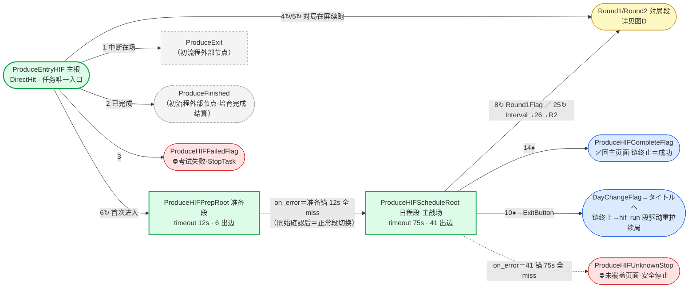

# HIF 管线状态机全景（核验视图）

> **唯一真源**：`assets/resource/base/pipeline/ProduceHIF.json`。本文是派生的核验视图，基线 2026-08-28 commit `9c61e87`（73 节点）。
> 第五~七节的图/表由 `tools/dump_hif_state_diagram.py` 从 JSON 机械导出（不漏边）；JSON 变更后重跑该脚本更新本文图表节。

## 一、图例与读法

| 记号 | 语义 |
|------|------|
| 节点 | 一个页面/弹窗的 Flag（识别锚 + 动作） |
| 实线 `n` / `n↻` | 引用方 next 数组第 n 项；`↻`＝`[JumpBack]` 前缀：**子链完成后回到引用根继续轮询**（回环）；无 `↻`＝子链完成后**终止任务链**（段结束，交外层 hif_run 段驱动重入或任务成功） |
| 节点名前 `●` | 该节点被非 JB 引用，其子链走完即链终止 |
| 虚线 `on_error` | 本节点 next 在 timeout 内全 miss 时走——**段切换语义，非故障** |
| 边上序号 | next 数组顺序＝**识别优先级**，靠前者先试；同一节点在不同引用处可有不同续接语义 |
| 颜色 | 绿＝路由根(DirectHit)｜蓝＝Custom 决策动作｜橙＝Click 推进｜黄＝DoNothing 纯锚｜红＝StopTask 终止｜灰虚＝初流程外部节点 |

## 二、图A 总览（阶段级）



要点：

- 入口三类出边：中断在场→`ProduceExit`（走初流程退出）；已完成→`FinishedFlag`→`ProduceFinished`；考试失败→`FailedFlag`⛔。
- `PrepRoot --on_error--> ScheduleRoot` 是正常推进路径：開始確認点击成功→开场演出→准备锚全灭 12s→交棒日程段。
- 全任务仅四种终态：✅`CompleteFlag` 链终止＝本轮成功；⛔`UnknownStop`／`FailedFlag` 安全停止；➡️`DayChange` 链终止后由 hif_run 段驱动重拉续局；➡️対局结算链尾（`RetryConfirm`→`ScoreSettlement` 等）链终止后同样交外层重拉。

## 三、图B 准备段（ProduceHIFPrepRoot）

```mermaid
flowchart TB
    PREP["ProduceHIFPrepRoot<br/>DirectHit · timeout 12s"]:::root
    SCHED["→ ScheduleRoot（图C）"]:::page
    PREP -.->|"on_error＝6 锚 12s 全 miss<br/>（正常段切换）"| SCHED
    ML["1↻ MemoryLimitFlag<br/>メモリー所持上限→点変換<br/>（変換链见图C）"]:::click
    AP["2↻ LackAPFlag<br/>模板 ap_lack 体力不足弹窗"]:::flag
    APR["LackAPRestoreFlag<br/>恢复页点体力药"]:::click
    APD["LackAPDecideFlag<br/>再点恢復"]:::click
    APU["LackAPUseFlag·leaf<br/>使用体力药"]:::click
    SC["3↻ StartConfirmFlag<br/>Custom 開始確認→プロデュース開始"]:::cust
    IDOL["4↻ IdolSelectFlag<br/>Custom 偶像选择"]:::cust
    PITM["5↻ ChooseHIFPItemFlag<br/>Custom PItem（存在性未取证）"]:::cust
    FM["6↻ FinalModeFlag<br/>Custom 活动主页本戦 tab"]:::cust

    PREP -->|1| ML
    PREP -->|2| AP
    PREP -->|3| SC
    PREP -->|4| IDOL
    PREP -->|5| PITM
    PREP -->|6| FM
    AP -->|1| APR
    APR -->|1| APD
    APR -->|"2↻"| APU
    APD -->|"子链完→回根"| PREP

    classDef root fill:#dcfce7,stroke:#16a34a,stroke-width:2px
    classDef page fill:#fef9c3,stroke:#ca8a04
    classDef cust fill:#dbeafe,stroke:#2563eb
    classDef click fill:#ffedd5,stroke:#ea580c
    classDef flag fill:#fef9c3,stroke:#ca8a04
```

核验锚序：③`StartConfirmFlag`（专有词「選択中の選抜試験」）必须排在 ④`IdolSelectFlag`（泛词「アイドル選択」，步骤条 1/2 两页共显）之前。

## 四、图D 対局段放大（消歧与 override 分叉）

```mermaid
flowchart TB
    R1F["ProduceHIFRound1Flag<br/>OCR 残りターン"]:::flag
    R2F["ProduceHIFRound2Flag<br/>OCR 1[0-2] 两位数消歧"]:::flag
    OBS["Round1ObserveFlag<br/>Custom 只读手牌"]:::cust
    RSTOP(["Round1ReachedStop<br/>⛔观察边界·StopTask"]):::stop
    R1P["Round1PlayFlag<br/>Custom 出牌大包·9 回合<br/>仅 override 接入"]:::cust
    R2P["Round2PlayFlag<br/>Custom 出牌大包 r2·12 回合<br/>timeout 20s"]:::cust
    INTV["IntervalFlag<br/>Custom·timeout 120s"]:::cust
    R2C["R2ConditionFlag<br/>優勝条件页点底部"]:::click
    R1RES["Round1ResultFlag→次へ·leaf"]:::flag
    STAR["Round1StarGainFlag·leaf"]:::click
    SUM["Round1SummaryFlag·leaf"]:::click
    TAP["TapNextFlag·leaf"]:::click
    CHEER["CheerStickBlank·leaf"]:::click
    R2RES["Round2ResultFlag→次へ·leaf"]:::flag
    DEF["Round2DefeatFlag→次へ·leaf"]:::flag
    DAYC["DayChangeFlag→タイトルヘ<br/>●链终止→重拉"]:::flag
    RETRY["RetryConfirmFlag<br/>Custom 再挑戦確認→終了"]:::cust
    SETTLE["ScoreSettlementFlag<br/>最終評価"]:::click

    R1F -->|"1 消歧"| R2F
    R1F -->|"2 默认＝观察"| OBS
    OBS -->|1| RSTOP
    R1F -.->|"override「Round1 出牌」＝Yes 时 2 替换为出牌"| R1P
    R2F -->|1| R2P
    INTV -->|1| R2C
    R2C -->|1| R2F

    R1P -->|"1↻"| R1RES
    R1P -->|"2↻"| STAR
    R1P -->|"3↻"| SUM
    R1P -->|"4↻"| TAP
    R1P -->|"5●"| DAYC
    R1P -->|"6↻"| CHEER
    R1P -->|7| INTV
    R2P -->|"1↻"| R2RES
    R2P -->|"2↻"| DEF
    R2P -->|"3↻"| R1RES
    R2P -->|"4↻"| STAR
    R2P -->|"5↻"| TAP
    R2P -->|"6●"| DAYC
    R2P -->|7| RETRY
    RETRY -->|1| SETTLE
    R2P -.->|"on_error"| SCHEDROOTREF["→ ScheduleRoot（图C）"]:::page
    R1P -.->|"on_error"| SCHEDROOTREF

    classDef page fill:#fef9c3,stroke:#ca8a04
    classDef stop fill:#fee2e2,stroke:#dc2626
    classDef cust fill:#dbeafe,stroke:#2563eb
    classDef click fill:#ffedd5,stroke:#ea580c
    classDef flag fill:#fef9c3,stroke:#ca8a04
```

- 锚「残りターン」在 R2 盘面（残りターン 10-12）同样命中，必须先试两位数 `Round2Flag` 消歧，顺序不可颠倒。
- `IntervalFlag` 有两个入口：ScheduleRoot 25↻（图C）与 `Round1PlayFlag` 第 7 出边；timeout 120s 为取证模式（issue #24）保留。
- `ScoreSettlementFlag` 双入口语义：自 ScheduleRoot 20↻ 进入＝JB 回根继续 Memory/報酬链；自 R2Play 第 7 出边直入＝子链走完即链终止，交外层 hif_run 重拉。两条路均已実機走通。


## 五、ScheduleRoot 出边序表（序号＝识别优先级；节点为去前缀短名）

| # | 目标 | JB | 识别 | 动作 |
|---|------|----|------|------|
| 1 | DrinkOverflowFlag | Y | OCR「[PＰ]ドリンク所持上限」 | Custom ProduceChooseHIFDrinkOverflowAuto |
| 2 | StatePanelCloseFlag | Y | OCR「(再演)」 等3条 | Click(360,755) |
| 3 | MemAbilityCloseFlag | Y | OCR「発動予約」 等2条 | Click(360,870) |
| 4 | CardDetailCloseFlag | Y | OCR「スキルカード詳細」 | Click(360,730) |
| 5 | MemoryLimitFlag | Y | OCR「メモリー所持上限」 | Click(522,1141) |
| 6 | OpeningCommuSkipFlag | Y | OCR「SKIP」 | Custom ProduceHIFGuardedTapAuto |
| 7 | SupportEventPopup | Y | OCR「サポートイベント効果」 | Click(325,1156) |
| 8 | Round1Flag | Y | OCR「残りターン」 | DoNothing |
| 9 | TapNextFlag | Y | OCR「タップして次へ」 等4条 | Click 锚本体 |
| 10 | DayChangeFlag |  | OCR「日付が変わりました」 | DoNothing |
| 11 | DialogBlank | Y | 模板 autodev/hif_dialog_nameplate.png | Click(360,640) |
| 12 | RewardPageFlag | Y | OCR「HIF報酬」 等6条 | Custom ProduceHIFRewardPageNextAuto |
| 13 | GashaAdCloseFlag | Y | OCR「ガシヤ」 等3条 | Click(360,1175) |
| 14 | CompleteFlag |  | OCR「プロデュース」 | DoNothing |
| 15 | Round1ResultFlag | Y | OCR「ラウンド1結果」 | DoNothing |
| 16 | Round1StarGainFlag | Y | OCR「スター性獲得」 | Click 锚本体 |
| 17 | CheerStickBlank | Y | OCR「試験開始時」 等2条 | Click(360,500) |
| 18 | Round2ResultFlag | Y | OCR「ラウンド2結果」 等2条 | DoNothing |
| 19 | Round2DefeatFlag | Y | OCR「敗退」 | DoNothing |
| 20 | RetryConfirmFlag | Y | OCR「再挑戦が可能」 等2条 | Custom ProduceHIFRetryConfirmAuto |
| 21 | ScoreSettlementFlag | Y | OCR「プロデュース評価」 等2条 | Click(360,1140) |
| 22 | MemoryFlag | Y | OCR「MEMORY」 等2条 | DoNothing |
| 23 | MemoryDetailNextFlag | Y | OCR「獲得可能」 等2条 | Custom ProduceHIFMemoryDetailNextAuto |
| 24 | ItemGainFlag | Y | OCR「イテム獲得」 等2条 | Click(360,1200) |
| 25 | IntervalFlag | Y | OCR「インターバル」 | Custom ProduceHIFIntervalAuto |
| 26 | R2ConditionFlag | Y | OCR「合計評価で」 等3条 | Click(360,1150) |
| 27 | PDrinkObtainedBlank | Y | OCR「初星水」 等29条 | Custom ProduceHIFPDrinkObtainedAuto |
| 28 | SelectChangeTargetFlag | Y | OCR「チェンジで獲得するスキルカードを選んでください」 | Custom ProduceChooseHIFSelectChangeTargetAuto |
| 29 | SelectChangeSourceFlag | Y | OCR「チェンジするスキルカードを選択してください」 | Custom ProduceChooseHIFSelectChangeSourceAuto |
| 30 | SelectChangeDoneFlag | Y | OCR「チェンジしま」 等3条 | Custom ProduceHIFSelectChangeDoneAuto |
| 31 | DrinkRewardFlag | Y | 模板 autodev/hif_drink_reward_title.png | Custom ProduceChooseHIFDrinkRewardAuto |
| 32 | SkillRewardFlag | Y | OCR「受け取るスキルカードを選んでください」 | Custom ProduceChooseHIFSkillRewardAuto |
| 33 | RewardConfirmFlag | Y | OCR「受け取る」 | Click(360,1080) |
| 34 | ConsultFlag | Y | OCR「Pポイントと交換するものを選んでください」 | Custom ProduceHIFConsultAuto |
| 35 | SPCardFlag | Y | OCR「レッスン終了時」 | Custom ProduceChooseHIFSPCardAuto |
| 36 | PGainBlank | Y | OCR「[+＋][0-9]+[pPＰ]」 等2条 | Click 锚本体 |
| 37 | ClassOptionFlag | Y | OCR「授業」 等2条 | Custom ProduceChooseHIFClassOptionAuto |
| 38 | CardShowBlank | Y | OCR「レッスン中1回」 | Click(360,500) |
| 39 | EventFlag | Y | 模板 autodev/hif_event_countdown.png | Custom ProduceChooseHIFEventAuto |
| 40 | PublicLessonResultFlag | Y | OCR「公開レッス」 等2条 | DoNothing |
| 41 | GiftTalkBlank | Y | OCR「差し入れ」 | Custom ProduceHIFGuardedTapAuto |

一圈耗时估算: OCR锚 38 个 ×~2s + 模板锚 3 个 ×~0.3s ≈ 77s （ScheduleRoot timeout=75s）

## 六、全节点总表（73 节点，短名同上）

| 节点 | 识别 | 动作 | next（序号，↻=JB） | timeout | on_error |
|------|------|------|--------------------|---------|----------|
| EventFlag | 模板 autodev/hif_event_countdown.png | Custom ProduceChooseHIFEventAuto | — |  | — |
| PItemFlag | OCR「カスタムPアイテム」 等2条 | Custom ProduceChooseHIFPItemAuto | — |  | — |
| EntryHIF | DirectHit | DoNothing | 1Exit / 2FinishedFlag / 3FailedFlag / 4↻Round1Flag / 5↻Round2Flag / 6↻PrepRoot |  | — |
| CardDetailCloseFlag | OCR「スキルカード詳細」 | Click(360,730) | — |  | — |
| CardShowBlank | OCR「レッスン中1回」 | Click(360,500) | — |  | — |
| CheerStickBlank | OCR「試験開始時」 等2条 | Click(360,500) | — |  | — |
| ClassOptionFlag | OCR「授業」 等2条 | Custom ProduceChooseHIFClassOptionAuto | — |  | — |
| CompleteFlag | OCR「プロデュース」 | DoNothing | — |  | — |
| ConsultFlag | OCR「Pポイントと交換するものを選んでください」 | Custom ProduceHIFConsultAuto | — |  | — |
| DayChangeExitButton | OCR「タイトル[へヘ]」 | Click(360,1155) | — |  | — |
| DayChangeFlag | OCR「日付が変わりました」 | DoNothing | 1DayChangeExitButton | 15s | — |
| DialogBlank | 模板 autodev/hif_dialog_nameplate.png | Click(360,640) | — |  | — |
| DrinkObtainedBlank | OCR「ランダムなドリンク」 等2条 | Click 锚本体 | — |  | — |
| DrinkOverflowFlag | OCR「[PＰ]ドリンク所持上限」 | Custom ProduceChooseHIFDrinkOverflowAuto | — |  | — |
| DrinkRewardFlag | 模板 autodev/hif_drink_reward_title.png | Custom ProduceChooseHIFDrinkRewardAuto | — |  | — |
| FailedFlag | 模板 produce/exam_failed.png | StopTask | — |  | — |
| FinalModeFlag | OCR「本戦モード」 等2条 | Custom ProduceHIFFinalModeAuto | — |  | — |
| FinishedFlag | 模板 produce/finished.png | DoNothing | 1Finished |  | — |
| GashaAdCloseFlag | OCR「ガシヤ」 等3条 | Click(360,1175) | — |  | — |
| GiftTalkBlank | OCR「差し入れ」 | Custom ProduceHIFGuardedTapAuto | — |  | — |
| IdolSelectFlag | OCR「アイドル選択」 | Custom ProduceHIFChooseIdolAuto | — |  | — |
| IntervalFlag | OCR「インターバル」 | Custom ProduceHIFIntervalAuto | 1R2ConditionFlag | 120s | ScheduleRoot |
| ItemGainFlag | OCR「イテム獲得」 等2条 | Click(360,1200) | — |  | — |
| KnownNextButton | 模板 next.png+1 | Click | — |  | — |
| LackAPDecideFlag | 模板 produce/ap_restore.png | Click | 1PrepRoot |  | — |
| LackAPFlag | 模板 produce/ap_lack.png | DoNothing | 1LackAPRestoreFlag |  | — |
| LackAPRestoreFlag | 模板 produce/ap_restore.png | Click | 1LackAPDecideFlag / 2↻LackAPUseFlag |  | — |
| LackAPUseFlag | 模板 produce/ap_use.png | Click | — |  | — |
| LessonSettleBlank | OCR「上昇した」 | Click 锚本体 | — |  | — |
| MemAbilityCloseFlag | OCR「発動予約」 等2条 | Click(360,870) | — |  | — |
| MemoryConvertConfirmFlag | OCR「変換確認」 | Click(522,1180) | — |  | — |
| MemoryConvertExecFlag | OCR「変換する」 | Click(380,1086) | 1MemoryConvertConfirmFlag | 20s | ScheduleRoot |
| MemoryConvertPageFlag | OCR「メモリー変換」 | Click(82,1001) | 1MemoryConvertExecFlag | 20s | ScheduleRoot |
| MemoryDetailNextFlag | OCR「獲得可能」 等2条 | Custom ProduceHIFMemoryDetailNextAuto | — |  | — |
| MemoryFlag | OCR「MEMORY」 等2条 | DoNothing | 1MemoryGenerateFlag / 2MemoryDetailNextFlag | 8s | ScheduleRoot |
| MemoryGenerateFlag | OCR「生成」 | Click | — |  | — |
| MemoryLimitFlag | OCR「メモリー所持上限」 | Click(522,1141) | 1MemoryConvertPageFlag | 20s | ScheduleRoot |
| OpeningCommuSkipFlag | OCR「SKIP」 | Custom ProduceHIFGuardedTapAuto | — |  | — |
| PDrinkObtainedBlank | OCR「初星水」 等29条 | Custom ProduceHIFPDrinkObtainedAuto | — |  | — |
| PGainBlank | OCR「[+＋][0-9]+[pPＰ]」 等2条 | Click 锚本体 | — |  | — |
| PrepRoot | DirectHit | DoNothing | 1↻MemoryLimitFlag / 2↻LackAPFlag / 3↻StartConfirmFlag / 4↻IdolSelectFlag / 5↻PItemFlag / 6↻FinalModeFlag | 12s | ScheduleRoot |
| PublicLessonResultFlag | OCR「公開レッス」 等2条 | DoNothing | 1↻PDrinkObtainedBlank / 2↻DrinkObtainedBlank / 3↻DrinkOverflowFlag / 4↻SPCardFlag / 5↻PGainBlank / 6↻KnownNextButton / 7↻LessonSettleBlank | 20s | ScheduleRoot |
| R2ConditionFlag | OCR「合計評価で」 等3条 | Click(360,1150) | 1Round2Flag | 20s | ScheduleRoot |
| RetryConfirmFlag | OCR「再挑戦が可能」 等2条 | Custom ProduceHIFRetryConfirmAuto | 1ScoreSettlementFlag | 30s | ScheduleRoot |
| RewardConfirmFlag | OCR「受け取る」 | Click(360,1080) | — |  | — |
| RewardPageFlag | OCR「HIF報酬」 等6条 | Custom ProduceHIFRewardPageNextAuto | — |  | — |
| Round1Flag | OCR「残りターン」 | DoNothing | 1Round2Flag / 2Round1ObserveFlag |  | — |
| Round1ObserveFlag | DirectHit | Custom ProduceHIFRound1Observe | 1Round1ReachedStop |  | — |
| Round1PlayFlag | DirectHit | Custom ProduceHIFRound1Play | 1↻Round1ResultFlag / 2↻Round1StarGainFlag / 3↻Round1SummaryFlag / 4↻TapNextFlag / 5DayChangeFlag / 6↻CheerStickBlank / 7IntervalFlag | 20s | ScheduleRoot |
| Round1ReachedStop | DirectHit | StopTask | — |  | — |
| Round1ResultFlag | OCR「ラウンド1結果」 | DoNothing | 1Round1ResultNextButton |  | — |
| Round1ResultNextButton | OCR「次へ」 | Click 锚本体 | — |  | — |
| Round1StarGainFlag | OCR「スター性獲得」 | Click 锚本体 | — |  | — |
| Round1SummaryFlag | OCR「審査基準」 等2条 | Click 锚本体 | — |  | — |
| Round2DefeatFlag | OCR「敗退」 | DoNothing | 1Round2ResultNextButton |  | — |
| Round2Flag | OCR「1[0-2]」 | DoNothing | 1Round2PlayFlag |  | — |
| Round2PlayFlag | DirectHit | Custom ProduceHIFRound1Play | 1↻Round2ResultFlag / 2↻Round2DefeatFlag / 3↻Round1ResultFlag / 4↻Round1StarGainFlag / 5↻TapNextFlag / 6DayChangeFlag / 7RetryConfirmFlag | 20s | ScheduleRoot |
| Round2ResultFlag | OCR「ラウンド2結果」 等2条 | DoNothing | 1Round2ResultNextButton |  | — |
| Round2ResultNextButton | OCR「次へ」 | Click 锚本体 | — |  | — |
| SPCardFlag | OCR「レッスン終了時」 | Custom ProduceChooseHIFSPCardAuto | — |  | — |
| ScheduleRoot | DirectHit | DoNothing | 1↻DrinkOverflowFlag / 2↻StatePanelCloseFlag / 3↻MemAbilityCloseFlag / 4↻CardDetailCloseFlag / 5↻MemoryLimitFlag / 6↻OpeningCommuSkipFlag / 7↻SupportEventPopup / 8↻Round1Flag / 9↻TapNextFlag / 10DayChangeFlag / 11↻DialogBlank / 12↻RewardPageFlag / 13↻GashaAdCloseFlag / 14CompleteFlag / 15↻Round1ResultFlag / 16↻Round1StarGainFlag / 17↻CheerStickBlank / 18↻Round2ResultFlag / 19↻Round2DefeatFlag / 20↻RetryConfirmFlag / 21↻ScoreSettlementFlag / 22↻MemoryFlag / 23↻MemoryDetailNextFlag / 24↻ItemGainFlag / 25↻IntervalFlag / 26↻R2ConditionFlag / 27↻PDrinkObtainedBlank / 28↻SelectChangeTargetFlag / 29↻SelectChangeSourceFlag / 30↻SelectChangeDoneFlag / 31↻DrinkRewardFlag / 32↻SkillRewardFlag / 33↻RewardConfirmFlag / 34↻ConsultFlag / 35↻SPCardFlag / 36↻PGainBlank / 37↻ClassOptionFlag / 38↻CardShowBlank / 39↻EventFlag / 40↻PublicLessonResultFlag / 41↻GiftTalkBlank | 75s | UnknownStop |
| ScoreSettlementFlag | OCR「プロデュース評価」 等2条 | Click(360,1140) | — |  | — |
| SelectChangeDoneFlag | OCR「チェンジしま」 等3条 | Custom ProduceHIFSelectChangeDoneAuto | — |  | — |
| SelectChangeSourceFlag | OCR「チェンジするスキルカードを選択してください」 | Custom ProduceChooseHIFSelectChangeSourceAuto | — |  | — |
| SelectChangeTargetFlag | OCR「チェンジで獲得するスキルカードを選んでください」 | Custom ProduceChooseHIFSelectChangeTargetAuto | — |  | — |
| SelectionModeContinueButton | 模板 next.png+1 | Click | — |  | — |
| SelectionModeFlag | OCR「選抜試験モード」 等2条 | DoNothing | 1EventFlag / 2SelectionModeContinueButton / 3UnknownStop |  | — |
| SkillRewardFlag | OCR「受け取るスキルカードを選んでください」 | Custom ProduceChooseHIFSkillRewardAuto | — |  | — |
| StartConfirmFlag | OCR「選択中の選抜試験」 | Custom ProduceHIFStartConfirmAuto | — |  | — |
| StatePanelCloseFlag | OCR「(再演)」 等3条 | Click(360,755) | — |  | — |
| SupportEventPopup | OCR「サポートイベント効果」 | Click(325,1156) | — |  | — |
| TapNextFlag | OCR「タップして次へ」 等4条 | Click 锚本体 | — |  | — |
| UnknownStop | DirectHit | StopTask | — |  | — |

## 七、图C 日程段全量可达图（机械生成不漏边）
读取：子图按 pos 区段分组（节点前数字＝出边序号，↻＝JB、●＝非 JB 终止）；SGX 收纳子链内部与出口节点；边 label＝next 序号，虚线＝on_error。完整节点名见第六节总表。

```mermaid
flowchart TB
    ProduceHIFScheduleRoot["ScheduleRoot · DirectHit<br/>timeout 75s · 41 出边 · on_error→UnknownStop"]:::root
    subgraph SG1["pos1-7 浮层/弹窗关闭组"]
        direction TB
        ProduceHIFDrinkOverflowFlag("1↻ DrinkOverflowFlag<br/>Custom ProduceChooseHIFDrinkOverflowAuto"):::cust
        ProduceHIFStatePanelCloseFlag("2↻ StatePanelCloseFlag<br/>Click(360,755)"):::click
        ProduceHIFMemAbilityCloseFlag("3↻ MemAbilityCloseFlag<br/>Click(360,870)"):::click
        ProduceHIFCardDetailCloseFlag("4↻ CardDetailCloseFlag<br/>Click(360,730)"):::click
        ProduceHIFMemoryLimitFlag("5↻ MemoryLimitFlag<br/>Click(522,1141)"):::click
        ProduceHIFOpeningCommuSkipFlag("6↻ OpeningCommuSkipFlag<br/>Custom ProduceHIFGuardedTapAuto"):::cust
        ProduceHIFSupportEventPopup("7↻ SupportEventPopup<br/>Click(325,1156)"):::click
    end
    subgraph SG8["pos8-11 対局入口与通用推进"]
        direction TB
        ProduceHIFRound1Flag("8↻ Round1Flag<br/>DoNothing"):::flag
        ProduceHIFTapNextFlag("9↻ TapNextFlag<br/>Click 锚本体"):::click
        ProduceHIFDayChangeFlag("10● DayChangeFlag<br/>DoNothing"):::flag
        ProduceHIFDialogBlank("11↻ DialogBlank<br/>Click(360,640)"):::click
    end
    subgraph SG12["pos12-20 報酬/結果/再挑戦"]
        direction TB
        ProduceHIFRewardPageFlag("12↻ RewardPageFlag<br/>Custom ProduceHIFRewardPageNextAuto"):::cust
        ProduceHIFGashaAdCloseFlag("13↻ GashaAdCloseFlag<br/>Click(360,1175)"):::click
        ProduceHIFCompleteFlag("14● CompleteFlag<br/>DoNothing"):::flag
        ProduceHIFRound1ResultFlag("15↻ Round1ResultFlag<br/>DoNothing"):::flag
        ProduceHIFRound1StarGainFlag("16↻ Round1StarGainFlag<br/>Click 锚本体"):::click
        ProduceHIFCheerStickBlank("17↻ CheerStickBlank<br/>Click(360,500)"):::click
        ProduceHIFRound2ResultFlag("18↻ Round2ResultFlag<br/>DoNothing"):::flag
        ProduceHIFRound2DefeatFlag("19↻ Round2DefeatFlag<br/>DoNothing"):::flag
        ProduceHIFRetryConfirmFlag("20↻ RetryConfirmFlag<br/>Custom ProduceHIFRetryConfirmAuto"):::cust
    end
    subgraph SG21["pos21-27 最終評価/メモリー/Interval"]
        direction TB
        ProduceHIFScoreSettlementFlag("21↻ ScoreSettlementFlag<br/>Click(360,1140)"):::click
        ProduceHIFMemoryFlag("22↻ MemoryFlag<br/>DoNothing"):::flag
        ProduceHIFMemoryDetailNextFlag("23↻ MemoryDetailNextFlag<br/>Custom ProduceHIFMemoryDetailNextAuto"):::cust
        ProduceHIFItemGainFlag("24↻ ItemGainFlag<br/>Click(360,1200)"):::click
        ProduceHIFIntervalFlag("25↻ IntervalFlag<br/>Custom ProduceHIFIntervalAuto"):::cust
        ProduceHIFR2ConditionFlag("26↻ R2ConditionFlag<br/>Click(360,1150)"):::click
        ProduceHIFPDrinkObtainedBlank("27↻ PDrinkObtainedBlank<br/>Custom ProduceHIFPDrinkObtainedAuto"):::cust
    end
    subgraph SG28["pos28-40 日程行动子页/公開レッスン子宿主"]
        direction TB
        ProduceHIFSelectChangeTargetFlag("28↻ SelectChangeTargetFlag<br/>Custom ProduceChooseHIFSelectChangeTargetAuto"):::cust
        ProduceHIFSelectChangeSourceFlag("29↻ SelectChangeSourceFlag<br/>Custom ProduceChooseHIFSelectChangeSourceAuto"):::cust
        ProduceHIFSelectChangeDoneFlag("30↻ SelectChangeDoneFlag<br/>Custom ProduceHIFSelectChangeDoneAuto"):::cust
        ProduceHIFDrinkRewardFlag("31↻ DrinkRewardFlag<br/>Custom ProduceChooseHIFDrinkRewardAuto"):::cust
        ProduceHIFSkillRewardFlag("32↻ SkillRewardFlag<br/>Custom ProduceChooseHIFSkillRewardAuto"):::cust
        ProduceHIFRewardConfirmFlag("33↻ RewardConfirmFlag<br/>Click(360,1080)"):::click
        ProduceHIFConsultFlag("34↻ ConsultFlag<br/>Custom ProduceHIFConsultAuto"):::cust
        ProduceHIFSPCardFlag("35↻ SPCardFlag<br/>Custom ProduceChooseHIFSPCardAuto"):::cust
        ProduceHIFPGainBlank("36↻ PGainBlank<br/>Click 锚本体"):::click
        ProduceHIFClassOptionFlag("37↻ ClassOptionFlag<br/>Custom ProduceChooseHIFClassOptionAuto"):::cust
        ProduceHIFCardShowBlank("38↻ CardShowBlank<br/>Click(360,500)"):::click
        ProduceChooseHIFEventFlag("39↻ EventFlag<br/>Custom ProduceChooseHIFEventAuto"):::cust
        ProduceHIFPublicLessonResultFlag("40↻ PublicLessonResultFlag<br/>DoNothing"):::flag
    end
    subgraph SG41["pos41 尾部泛词兜底"]
        direction TB
        ProduceHIFGiftTalkBlank("41↻ GiftTalkBlank<br/>Custom ProduceHIFGuardedTapAuto"):::cust
    end
    subgraph SGX["子链内部与出口节点（由上述 Flag 的 next 可达）"]
        direction TB
        ProduceHIFMemoryConvertPageFlag("MemoryConvertPageFlag<br/>Click(82,1001)"):::click
        ProduceHIFRound2Flag("Round2Flag<br/>DoNothing"):::flag
        ProduceHIFRound1ObserveFlag("Round1ObserveFlag<br/>Custom ProduceHIFRound1Observe"):::cust
        ProduceHIFDayChangeExitButton("DayChangeExitButton<br/>Click(360,1155)"):::click
        ProduceHIFRound1ResultNextButton("Round1ResultNextButton<br/>Click 锚本体"):::click
        ProduceHIFRound2ResultNextButton("Round2ResultNextButton<br/>Click 锚本体"):::click
        ProduceHIFMemoryGenerateFlag("MemoryGenerateFlag<br/>Click"):::click
        ProduceHIFDrinkObtainedBlank("DrinkObtainedBlank<br/>Click 锚本体"):::click
        ProduceHIFKnownNextButton("KnownNextButton<br/>Click"):::click
        ProduceHIFLessonSettleBlank("LessonSettleBlank<br/>Click 锚本体"):::click
        ProduceHIFMemoryConvertExecFlag("MemoryConvertExecFlag<br/>Click(380,1086)"):::click
        ProduceHIFRound2PlayFlag("Round2PlayFlag<br/>Custom ProduceHIFRound1Play"):::cust
        ProduceHIFRound1ReachedStop("Round1ReachedStop<br/>StopTask"):::stop
        ProduceHIFMemoryConvertConfirmFlag("MemoryConvertConfirmFlag<br/>Click(522,1180)"):::click
    end
    ProduceHIFScheduleRoot -->|"1↻"| ProduceHIFDrinkOverflowFlag
    ProduceHIFScheduleRoot -->|"2↻"| ProduceHIFStatePanelCloseFlag
    ProduceHIFScheduleRoot -->|"3↻"| ProduceHIFMemAbilityCloseFlag
    ProduceHIFScheduleRoot -->|"4↻"| ProduceHIFCardDetailCloseFlag
    ProduceHIFScheduleRoot -->|"5↻"| ProduceHIFMemoryLimitFlag
    ProduceHIFScheduleRoot -->|"6↻"| ProduceHIFOpeningCommuSkipFlag
    ProduceHIFScheduleRoot -->|"7↻"| ProduceHIFSupportEventPopup
    ProduceHIFScheduleRoot -->|"8↻"| ProduceHIFRound1Flag
    ProduceHIFScheduleRoot -->|"9↻"| ProduceHIFTapNextFlag
    ProduceHIFScheduleRoot -->|"10"| ProduceHIFDayChangeFlag
    ProduceHIFScheduleRoot -->|"11↻"| ProduceHIFDialogBlank
    ProduceHIFScheduleRoot -->|"12↻"| ProduceHIFRewardPageFlag
    ProduceHIFScheduleRoot -->|"13↻"| ProduceHIFGashaAdCloseFlag
    ProduceHIFScheduleRoot -->|"14"| ProduceHIFCompleteFlag
    ProduceHIFScheduleRoot -->|"15↻"| ProduceHIFRound1ResultFlag
    ProduceHIFScheduleRoot -->|"16↻"| ProduceHIFRound1StarGainFlag
    ProduceHIFScheduleRoot -->|"17↻"| ProduceHIFCheerStickBlank
    ProduceHIFScheduleRoot -->|"18↻"| ProduceHIFRound2ResultFlag
    ProduceHIFScheduleRoot -->|"19↻"| ProduceHIFRound2DefeatFlag
    ProduceHIFScheduleRoot -->|"20↻"| ProduceHIFRetryConfirmFlag
    ProduceHIFScheduleRoot -->|"21↻"| ProduceHIFScoreSettlementFlag
    ProduceHIFScheduleRoot -->|"22↻"| ProduceHIFMemoryFlag
    ProduceHIFScheduleRoot -->|"23↻"| ProduceHIFMemoryDetailNextFlag
    ProduceHIFScheduleRoot -->|"24↻"| ProduceHIFItemGainFlag
    ProduceHIFScheduleRoot -->|"25↻"| ProduceHIFIntervalFlag
    ProduceHIFScheduleRoot -->|"26↻"| ProduceHIFR2ConditionFlag
    ProduceHIFScheduleRoot -->|"27↻"| ProduceHIFPDrinkObtainedBlank
    ProduceHIFScheduleRoot -->|"28↻"| ProduceHIFSelectChangeTargetFlag
    ProduceHIFScheduleRoot -->|"29↻"| ProduceHIFSelectChangeSourceFlag
    ProduceHIFScheduleRoot -->|"30↻"| ProduceHIFSelectChangeDoneFlag
    ProduceHIFScheduleRoot -->|"31↻"| ProduceHIFDrinkRewardFlag
    ProduceHIFScheduleRoot -->|"32↻"| ProduceHIFSkillRewardFlag
    ProduceHIFScheduleRoot -->|"33↻"| ProduceHIFRewardConfirmFlag
    ProduceHIFScheduleRoot -->|"34↻"| ProduceHIFConsultFlag
    ProduceHIFScheduleRoot -->|"35↻"| ProduceHIFSPCardFlag
    ProduceHIFScheduleRoot -->|"36↻"| ProduceHIFPGainBlank
    ProduceHIFScheduleRoot -->|"37↻"| ProduceHIFClassOptionFlag
    ProduceHIFScheduleRoot -->|"38↻"| ProduceHIFCardShowBlank
    ProduceHIFScheduleRoot -->|"39↻"| ProduceChooseHIFEventFlag
    ProduceHIFScheduleRoot -->|"40↻"| ProduceHIFPublicLessonResultFlag
    ProduceHIFScheduleRoot -->|"41↻"| ProduceHIFGiftTalkBlank
    ProduceHIFScheduleRoot -.->|"on_error"| ProduceHIFUnknownStop
    ProduceHIFMemoryLimitFlag -->|"1"| ProduceHIFMemoryConvertPageFlag
    ProduceHIFMemoryLimitFlag -.->|"on_error"| ProduceHIFScheduleRoot
    ProduceHIFRound1Flag -->|"1"| ProduceHIFRound2Flag
    ProduceHIFRound1Flag -->|"2"| ProduceHIFRound1ObserveFlag
    ProduceHIFDayChangeFlag -->|"1"| ProduceHIFDayChangeExitButton
    ProduceHIFRound1ResultFlag -->|"1"| ProduceHIFRound1ResultNextButton
    ProduceHIFRound2ResultFlag -->|"1"| ProduceHIFRound2ResultNextButton
    ProduceHIFRound2DefeatFlag -->|"1"| ProduceHIFRound2ResultNextButton
    ProduceHIFRetryConfirmFlag -->|"1"| ProduceHIFScoreSettlementFlag
    ProduceHIFRetryConfirmFlag -.->|"on_error"| ProduceHIFScheduleRoot
    ProduceHIFMemoryFlag -->|"1"| ProduceHIFMemoryGenerateFlag
    ProduceHIFMemoryFlag -->|"2"| ProduceHIFMemoryDetailNextFlag
    ProduceHIFMemoryFlag -.->|"on_error"| ProduceHIFScheduleRoot
    ProduceHIFIntervalFlag -->|"1"| ProduceHIFR2ConditionFlag
    ProduceHIFIntervalFlag -.->|"on_error"| ProduceHIFScheduleRoot
    ProduceHIFR2ConditionFlag -->|"1"| ProduceHIFRound2Flag
    ProduceHIFR2ConditionFlag -.->|"on_error"| ProduceHIFScheduleRoot
    ProduceHIFPublicLessonResultFlag -->|"1↻"| ProduceHIFPDrinkObtainedBlank
    ProduceHIFPublicLessonResultFlag -->|"2↻"| ProduceHIFDrinkObtainedBlank
    ProduceHIFPublicLessonResultFlag -->|"3↻"| ProduceHIFDrinkOverflowFlag
    ProduceHIFPublicLessonResultFlag -->|"4↻"| ProduceHIFSPCardFlag
    ProduceHIFPublicLessonResultFlag -->|"5↻"| ProduceHIFPGainBlank
    ProduceHIFPublicLessonResultFlag -->|"6↻"| ProduceHIFKnownNextButton
    ProduceHIFPublicLessonResultFlag -->|"7↻"| ProduceHIFLessonSettleBlank
    ProduceHIFPublicLessonResultFlag -.->|"on_error"| ProduceHIFScheduleRoot
    ProduceHIFMemoryConvertPageFlag -->|"1"| ProduceHIFMemoryConvertExecFlag
    ProduceHIFMemoryConvertPageFlag -.->|"on_error"| ProduceHIFScheduleRoot
    ProduceHIFRound2Flag -->|"1"| ProduceHIFRound2PlayFlag
    ProduceHIFRound1ObserveFlag -->|"1"| ProduceHIFRound1ReachedStop
    ProduceHIFMemoryConvertExecFlag -->|"1"| ProduceHIFMemoryConvertConfirmFlag
    ProduceHIFMemoryConvertExecFlag -.->|"on_error"| ProduceHIFScheduleRoot
    ProduceHIFRound2PlayFlag -->|"1↻"| ProduceHIFRound2ResultFlag
    ProduceHIFRound2PlayFlag -->|"2↻"| ProduceHIFRound2DefeatFlag
    ProduceHIFRound2PlayFlag -->|"3↻"| ProduceHIFRound1ResultFlag
    ProduceHIFRound2PlayFlag -->|"4↻"| ProduceHIFRound1StarGainFlag
    ProduceHIFRound2PlayFlag -->|"5↻"| ProduceHIFTapNextFlag
    ProduceHIFRound2PlayFlag -->|"6"| ProduceHIFDayChangeFlag
    ProduceHIFRound2PlayFlag -->|"7"| ProduceHIFRetryConfirmFlag
    ProduceHIFRound2PlayFlag -.->|"on_error"| ProduceHIFScheduleRoot
    classDef root fill:#dcfce7,stroke:#16a34a,stroke-width:2px
    classDef cust fill:#dbeafe,stroke:#2563eb
    classDef click fill:#ffedd5,stroke:#ea580c
    classDef flag fill:#fef9c3,stroke:#ca8a04
    classDef stop fill:#fee2e2,stroke:#dc2626
    classDef ext fill:#f4f4f5,stroke:#a1a1aa,stroke-dasharray:4
```
## 八、特殊接线与孤儿节点

- `Round1PlayFlag`：静态零引用，仅当任务选项「Round1 出牌」＝Yes 时，由 `assets/tasks/produce.json` 的 `pipeline_override` 把 `Round1Flag.next` 替换为 `{Round2Flag, Round1PlayFlag}` 接入（默认走 Observe 观察链）。
- `SelectionModeFlag` / `SelectionModeContinueButton`：**全仓库零引用死节点**（選抜試験モード页文案未取证、疑似不存在），建议删除或建 issue。
- `ProduceExit` / `ProduceFinished`：初流程 `Produce.json` 外部节点，本文仅占位。
- `Round1ObserveFlag → Round1ReachedStop`：首版观察边界——出牌策略接线前，Round1 到达即安全停止。

## 九、人工核验清单

逐条对照 JSON 打勾：

1. [ ] **识别优先级锚序**：PrepRoot ③先于④（见第三节）；ScheduleRoot pos1-4 浮层关闭组最前（面板专有词锚），pos41 `GiftTalkBlank` 泛词兜底最后（差し入れ残留泛锚只配尾位）。
2. [ ] **消歧顺序**：`Round1Flag` → ①`Round2Flag`（两位数 `1[0-2]`）先于 ②Observe/Play。
3. [ ] **on_error 全部指上层路由根**：PrepRoot→ScheduleRoot；`Round2PlayFlag`/`Round1PlayFlag`/`IntervalFlag`/`MemoryLimitFlag` 变換链/`RetryConfirmFlag`/`PublicLessonResultFlag` 子宿主→ScheduleRoot；**无任何子宿主直指 UnknownStop**；`UnknownStop` 仅出现在 ScheduleRoot.on_error（外加死节点 SelectionModeFlag 的 next 尾）。
4. [ ] **JB 完备性**：所有点击/翻页推进类在引用处均带 `↻`；非 JB 终止语义仅限——Entry→Exit/Finished/Failed、ScheduleRoot `10●DayChange`／`14●Complete`、`Observe→ReachedStop`、`R2Play 6●/7`、`R1Play 5●/7`——逐个核对其后外层接续（hif_run 段驱动重入／任务成功）符合预期。
5. [ ] **timeout 与轮询一圈耗时**：ScheduleRoot 75s vs 一圈估算 ~77s（38 OCR×2s＋3 模板×0.3s，粗估上限）；先例：40s 曾饿死第 11 位之后全部锚。尾部锚（40 公開レッスン／41 差し入れ）依赖「全 miss 一圈」走完才被轮询，建议実測一圈耗时后再定是否上调。
6. [ ] **文档滞后项**（本次核验发现，待修）：AGENTS.md「ProduceHIF.json 当前约 37 节点」实际 73；「Round2Flag、IntervalFlag、ScoreSettlementFlag、MemoryFlag 目前只指向 ProduceHIFUnknownStop」四链均已实现。
7. [ ] **抽查 10 条边**：从图C 随机抽边与 JSON 原文对照，排除生成器自身 bug 后即可信任全图。
